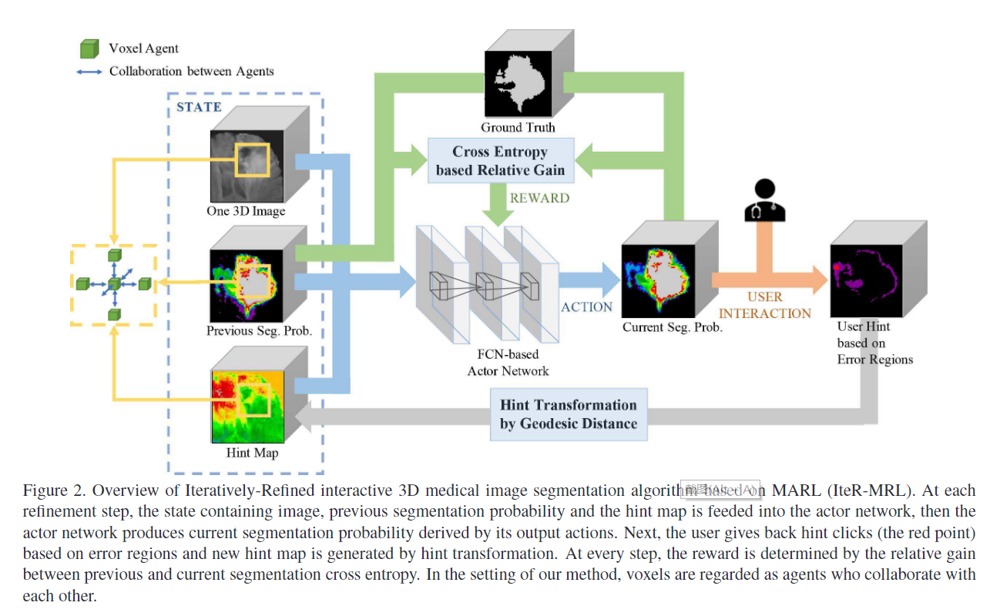

# Iteratively-Refined Interactive 3D Medical Image Segmentation with Multi-Agent Reinforcement Learning
作者 | Xuan Liao, Wenhao Li, Qisen Xu, Xiangfeng Wang, Bo Jin, Xiaoyun Zhang, Yanfeng Wang, Ya Zhang

单位 | 上海交通大学；华东师范大学

## **介绍**
文章提出了一种结合强化学习交互过程的图像分割的方法，并且将医疗图像的每个体素看作一个agent，这就将边缘检测任务转化为了多智能体的强化学习任务。并且用交叉熵函数作为奖励函数来更新策略。如果只将图像看作一个智能体，那么解的搜索空间是非常巨大的，multi agent还有一个优点就是可以捕捉到体素之间的依赖情况。
## **之前的方法中存在的问题**
1. 他们忽略了连续步骤中的连续交互的动态过程，总是独立的处理每次分割。
2. 另外一个问题是用二值化的图像分割结果不如用概率来表示，用二值化的话无疑再每次迭代过程中会扩大误差
## **解决的问题**
* 将图像分割嵌入了强化学习框架。
* 用二分类的概率值表示结果，这样会更精确。
* 通过两个连续的交互步骤，对结果的提升效果是巨大的。
## **Methodology**
算法大致流程
.png)
强化学习框架

算法中state、action、reward分别定义如下

#### **State**

定义在第$t$轮迭代中的体素$x_i$上的状态$s^{(t)}_i=[b_i, p_i^{(t)}, h_{+, i}^{(t)}, h_{-, i}^{(t)}]$，其中$h_{+, i}^{(t)}, h_{-, i}^{(t)}$是指hint map的背景与目标层，它们共同组成了hint map。对于每个$h_{\mathscr{l}}^{(t)}, \mathscr{l}\in \left \{ +, -\right\}$, $h_{\mathscr{l}}^{(t)}=(h_{\mathscr{l}, 1}^{(t)}, h_{\mathscr{l}, 2}^{(t)}, \cdots, h_{\mathscr{l}, N}^{(t)})$,其中$h_{\mathscr{l}, i}^{(t)}$定义为$$h_{\mathscr{l}, i}^{(t)}=\underset{\forall x_j\in hs_{\mathscr{l}}^{(t)}}{min}\mathcal{M}(x_i, x_j),  \mathscr{l}\in \left \{ +, -\right\}$$
其中$hs_{\mathscr{+}}^{(t)}$代表提示图$h_{+}^{(t)}$（hints on object）上点的集合， $hs_{\mathscr{-}}^{(t)}$代表提示图$h_{-}^{(t)}$（hints on background）上点的集合。其中距离可以用高斯距离、欧式距离和测地线距离，paper中使用的测地线距离。

#### **Action**
动作$a_i^{(t)}\in \mathcal{A}$定义为在t个时间步中像素点$x_i$将上一步的概率值$p_i^{(t)}$调整$a_i^{(t)}$变为$p_i^{(t+1)}$,也即
$$p_i^{(t+1)} = \mathcal{C}_{0}^1(p_i^{(t)}+a_i^{(t)}),$$
$$\mathcal{C}_a^b(x)=min(max(x, a), b)$$
$\mathcal{C}_a^b(x)$是个裁剪函数，将函数值裁剪到$[a, b]$中。

#### **Reward**
使用交叉熵函数作为奖励函数更新模型，设计思想是**使一个像素点为真实值的概率值尽可能接近1，反之要接近0**，假设像素点$x_i$的真实值为$y_i$，且为$y_i$的分割概率为$p_i$，则奖励$r_i^{(t)}$为
$$r_i^{(t)}=\mathcal{X}_i^{(t-1)}-\mathcal{X}_i^{(t)}$$
其中
$$\mathcal{X}_i^{(t)}=-y_i\log(p_i^{(t)})-(1-y_i)\log(1-p_i^{(t)})$$
所以每回合的奖励函数为
$$\mathcal{R}_i = \sum_{t=1}^{T} \gamma^{(t-1)}r_i^{(t)} $$

## 网络和训练部分
训练网络部分
.png)
文章中采用的使A3C算法，其中的block是基于FCN的网络，用来处理图像，网络部分分为actor网络和value网络（即critic），参数分别设置为$\theta_p, \theta_v$，网络的输入使第$t$步的状态$s^{(t)}$，值网络部分输出的是当前状态的回报值$V(s^{(t)})$，$\theta_v$的梯度为
$$d\theta_v = \bigtriangledown_{\theta_v}A(s^{(t)}, a^{(t)})^2$$
$$A(s^{(t)}, a^{(t)})^2=\sum_{k=t}^{T}\gamma^{k-t}\overline{r}^{(k)}-V(s^{(t)})$$
其中$\overline{r}^{(k)}$是在第$k$时间步中所有体素的奖励的平均。
actor网络输出的是策略函数$\pi(a^{(t)}|s^{(t)})$，代表有多少概率去选择动作$a_i^{(t)}$,$\theta_p$的梯度为
$$d\theta_p = -\bigtriangledown_{\theta_p}\pi(a^{(t)}|s^{(t)})A(a^{(t)}, s^{(t)})$$
#### 实验部分
我们首先要训练出一个初始的粗分割方法，然后在此基础上进行迭代细化分割，所以我们也需要一个训练粗分割网络的数据集，将数据集分割为$D_{train1}, D_{train2}, D_{test}$三个数据集。\
评价函数为
$$Dice(S_p, S_g) = \frac{2|S_p\cap S_g|}{|S_p|+|S_g|}$$
$S_p$代表预测的分割，$S_g$代表真实值。在这个实验中我们能不仅要考虑上述评价函数，也要考虑用户交互次数。\
实验细节不再赘述。